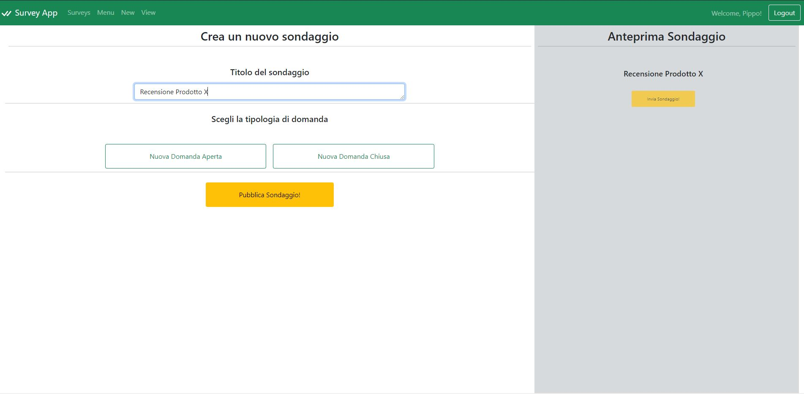
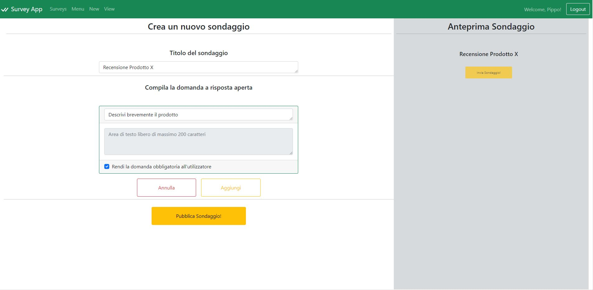
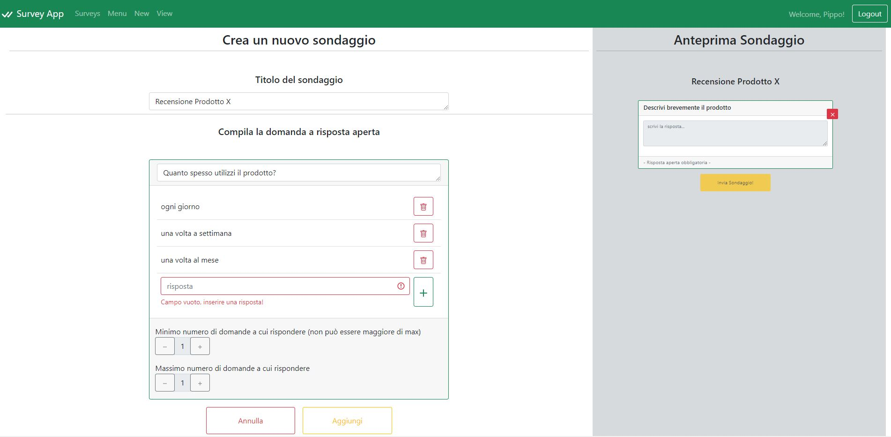

# Exam #1: "Questionario"
## Student: s287279 CIARDO ROBERTO 

## React Client Application Routes

#### Route `/surveys`: 
   - the page contains the list of surveys of all administrators
   - the utilizer can click on a survey to start filling it out
   - each survey is linked to `/surveys/:idsurvey`
#### Route `/surveys/:idsurvey`: 
   - the page forces the utilizer to enter the name and then proceed to fill in the survey questions
   - the utilizer can go back or send the survey via the button at the bottom
   - idsurvey identifies a specific survey of an administrator
#### Route `/cms/login`: 
   - the page requires credentials to access the administrator's content management system
   - after success is redirected to `/cms/menu`
#### Route `/cms/menu`:
   - the page contains a simple menu that allows to move between menu - (view/create) survey
   - accessible only to logged in administrator
#### Route `/cms/menu/newsurvey` the page is split in two parts:
   - the left part contains the structure that allows you to build a new survey:
        - a field for the title of the survey
        - a block of choice between open and closed question, with add and undo buttons for single questions
        - a button, at the bottom, that allows you to publish the survey
   - the right part shows the preview of the survey (post publication) and allows:
        -  the modification of the order of the questions
        -  the cancellation of the question
   - accessible only to logged in administrator
#### Route `/cms/menu/viewsurveys`: 
   - the page contains the survey list of the logged in administrator with, for each survey, the number of survey forms received
   - the administrator can click on a survey to start examining utilizer responses (linked to `/cms/menu/viewsurveys/:idsurvey`
   - accessible only to logged in administrator
#### Route `/cms/menu/viewsurveys/:idsurvey`:
   - the page contains the utilizer's responses to the survey specified by the idsurvey parameter
   - The administrator views one survey at a time and can scroll through them using the buttons at the bottom
   - accessible only to logged in administrator
   - idsurvey identifies a specific survey of an administrator

## API Server

### Survey Management

#### Get all surveys

* HTTP method: `GET`  URL: `/api/surveys`
* Description: Get the full list of surveys, and belong to visitors or administrators
* Request body: _None_
* Request query parameter: _None_
* Response: `200 OK` (success)
* Response body: Array of objects, each describing one survey basic information:

``` JSON
[{
    "idAdmin": 1,
    "idSurvey": 1,
    "title": "Survey app review"
}]
```

* Error responses:  `500 Internal Server Error` (generic error), `404 Not Found` (not present or unavailable)

#### Get survey by idsurvey

* HTTP method: `GET`  URL: `/api/surveys/:idsurvey`
* Description: Get the survey corresponding to the idsurvey
* Request body: _None_
* Request query parameter: _idsurvey_ identifies a specific survey
* Response: `200 OK` (success)
* Response body: Array of objects, each describing one question of the survey:

``` JSON
[{
    "idQuestion": 1,
    "idSurvey": 1,
    "question": "Question 1",
    "type": "A",
    "max": null,
    "min": null,
    "openAnswer": "",
    "isOptional": 0,
    "errorMessageCA": "",
    "errorMessageOA": ""
},
{
    "idQuestion": 2,
    "idSurvey": 1,
    "question": "Question 2",
    "type": "C",
    "max": 1,
    "min": 1,
    "optionList:": 
      [{ 
        "idOption": 1,
        "option": "Option 1",
        "isChecked": false
      },{ 
        "idOption": 2,
        "option": "Option 2",
        "isChecked": false
      },],
    "openAnswer": "",
    "isOptional": null,
    "errorMessageCA": "",
    "errorMessageOA": ""
}]
```

* Error responses:  `500 Internal Server Error` (generic error), `404 Not Found` (not present or unavailable), `422 Unprocessable Entity` (values do not satisfy validators)

### Administrator management

#### Get the administrator's surveys

* HTTP method: `GET`  URL: `/api/administrators/:idadmin/surveys`
* Description: Get the full list of surveys that match the query filter parameter (idadmin) which then belong to the logged administrator
* Request body: _None_
* Request query parameter: _idadmin_ identifies a specific administrator
* Response: `200 OK` (success)
* Response body: Array of objects, each describing one survey basic information:

``` JSON
[{
    "idAdmin": 1,
    "idSurvey": 1,
    "numCompiled": 99,
    "title": "Survey app review"
}]
```

* Error responses:  `500 Internal Server Error` (generic error), `404 Not Found` (not present or unavailable), `422 Unprocessable Entity` (values do not satisfy validators)

#### Get the administrator's survey by idsurvey

* HTTP method: `GET`  URL: `/api/administrators/:idadmin/surveys/:idsurvey`
* Description: Get the survey of the administrator selected by idadmin corresponding to the idsurvey, and belong to the logged administrator
* Request body: _None_
* Request query parameter: _idadmin_ identifies a specific administrator, _idsurvey_ identifies a specific survey
* Response: `200 OK` (success)
* Response body: Array of objects, each describing:
  - an object that describes the characteristics of the utilizer
  - an array of objects, each describing one question of the survey

``` JSON
[{
    "utilizer": 
      {
        "idUtilizer": 1, 
        "name": "Pippo"
      },
    "questionList": 
      [{
        "idQuestion": 1,
        "idSurvey": 1,
        "question": "Question 1",
        "type": "A",
        "max": null,
        "min": null,
        "openAnswer": "Open answer of the utilizer",
        "isOptional": 0
      },
      {
        "idQuestion": 2,
        "idSurvey": 1,
        "question": "Question 2",
        "type": "C",
        "max": 1,
        "min": 1,
        "optionList:": 
          [{ 
            "idOption": 1,
            "option": "Option 1",
            "isChecked": true
          },{ 
            "idOption": 2,
            "option": "Option 2",
            "isChecked": false
          },],
        "openAnswer": null,
        "isOptional": null
      }]
}]
```

* Error responses:  `500 Internal Server Error` (generic error), `404 Not Found` (not present or unavailable), `422 Unprocessable Entity` (values do not satisfy validators)

#### Add a new survey

* HTTP method: `POST`  URL: `/api/surveys`
* Description: Add a new survey to the surveys of the logged administrator
* Request body: description of the object to add, dependent on the type attribute

``` JSON
{
    "idAdmin": 1,
    "title": "Title of the survey",
    "questionList": 
      [{
        "question": "Question 1",
        "type": "A",
        "isOptional": true
      },
      {
        "question": "Question 2",
        "type": "C",
        "max": 1,
        "min": 1,
        "optionList:": 
          [{ 
            "option": "Option 1"
          },{
            "option": "Option 2"
          },]
      }]
}
```

* Response: `201 CREATED` (success)
* Response body: _None_

* Error responses:  `422 Unprocessable Entity` (values do not satisfy validators), `503 Service Unavailable` (database error)

#### Add a new answer

* HTTP method: `POST`  URL: `/api/answers`
* Description: Add a new answer to the answers of the utilizers
* Request body: description of the object to add, dependent on the type attribute

``` JSON
{
    "name": "Name of utilizer",
    "questionList": 
      [{
        "idSurvey": 1,
        "idQuestion": 1,
        "type": "A",
        "openAnswer": "Answer of utilizer"
      },
      {
        "idSurvey": 1,
        "idQuestion": 2,
        "type": "C",
        "optionList:": 
          [{ 
            "idOption": 1,
            "isChecked": true
          },{
            "idOption": 2,
            "isChecked": true
          },],
      }]
}
```

* Response: `201 CREATED` (success)
* Response body: _None_

* Error responses:  `422 Unprocessable Entity` (values do not satisfy validators), `503 Service Unavailable` (database error)

#### Login

* HTTP method: `POST`  URL: `/api/sessions`
* Description: authenticate the administrator who is trying to login
* Request body: credentials of the administrator who is trying to login

``` JSON
{
    "username": "username",
    "password": "password"
}
```

* Response: `200 OK` (success)
* Response body: authenticated administrator

``` JSON
{
    "id": 1,
    "username": "john.doe@polito.it", 
    "name": "John"
}
```
* Error responses:  `500 Internal Server Error` (generic error), `401 Unauthorized User` (login failed), `422 Unprocessable Entity` (values do not satisfy validators)


#### Check if administrator is logged in

* HTTP method: `GET`  URL: `/api/sessions/current`
* Description: check if current administrator is logged in and get her data
* Request body: _None_
* Response: `200 OK` (success)

* Response body: authenticated administrator

``` JSON
{
    "id": 1,
    "username": "john.doe@polito.it", 
    "name": "John"
}
```

* Error responses:  `500 Internal Server Error` (generic error), `401 Unauthorized Administrator` (administrator is not logged in)


#### Logout

* HTTP method: `DELETE`  URL: `/api/sessions/current`
* Description: logout current administrator
* Request body: _None_
* Response: `200 OK` (success)

* Response body: _None_

* Error responses:  `500 Internal Server Error` (generic error), `401 Unauthorized Administrator` (administrator is not logged in)


## Database Tables

| Name | Attr_1 | Attr_2 | Attr_3 | Attr_4 | Attr_5 | Attr_6 | Attr_7 |
| ------------- | ------------- | ------------- | ------------- | ------------- | ------------- | ------------- | ------------- |
| `administrator` | IdAdmin | email | name | hash |
| `answer` | IdAnswer | IdUtilizer | IdSurvey | IdQuestion | IdOption | Selected | FreeText |
| `option` | IdOption | Option | IdQuestion |
| `question` | IdQuestion | Question | IdSurvey | Type | Min | Max | IsOptional |
| `survey` | IdSurvey | Title | IdAdmin |
| `utilizer` | IdUtilizer | Name |

## Main React Components

#### `LoginForm` (in `Login.js`) 
- Used to login
- Component consisting of:
   - alerts for error management
   - email input with validation
   - password input with validation
   - confirmation button, needs a _login_ function as props
   - quick login credentials

#### `MenuAdmin` (in `MenuAdmin.js`) 
- Used in the content management system, to direct the administrator to the survey creation or viewing page
- Component consisting of:
   - title
   - two link buttons (`/cms/menu/newsurvey`, `/cms/menu/viewsurveys`)

#### `Navigation` (in `Navigation.js`) 
- Used on all pages to show the web application header
- Component consisting of:
   - brand
   - link to `/surveys` always present
   - links to `/cms/menu`, `/cms/menu/newsurvey` and `/cms/menu/viewsurveys` depending on the _loggedIn_ props (indicates logged in admin status)
   - login/logout functions depending on the _loggedIn_ props (indicates logged in admin status), needs a _logout_ function as props and _admin_ information
   
#### `SurveyList` (in `SurveyList.js`) 
- Used on the user side to load the list of all surveys of all administrators; admin side to load the list of own surveys
- Component consisting of:
   - _loggedIn_ props: to differentiate the cases mentioned above
   - _surveyList_ props: survey list that contains idSurvey, other..
   - list of buttons depending on idSurvey that linked to `/cms/menu/viewsurveys/:idsurvey` or `/surveys/:idsurvey`
   - in the administrator case, if there are no completed surveys, a modal is displayed when the button is clicked

#### `PageCreateSurvey` (in `PageCreateSurvey.js`) 
- Used as a wrapper to create the survey creation page
- Component consisting of:
   - input title
   - input component `NewQuestion` (described below)
   - component `ModalSend` for safety
   - component `QuestionList` for preview

#### `PageQuestionList` (in `PageQuestionList.js`) 
- Used as a casing user side to view the questions to be answered; administrator side to view user responses
- Component consisting of:
   - loading: waits for the response from the server and signals it to the user with a spinner
   - _isAdmin_ props: to differentiate the cases mentioned above
   - definedName and `QuestionName` (no admin): to block the user from entering a name 
   - component `HandlePages` (admin): page manager forward back
   - component `QuestionList` (described below)

#### `QuestionList` (in `QuestionList.js`) 
- Used on the user side to load the list of questions of the survey chosen to be filled in (child of `PageQuestionList`); administrator side to show a preview, in real time, of the survey being created (child of `PageCreateSurvey`) and to show the list of compiled questions in the viewing page (child of `PageQuestionList`)
- Component consisting of:
   - title
   - list of question
   - button send compiled survey
- `Question` (in `QuestionList.js`)
   - question is a subcomponent that creates a Bootstrap Card whose body depends on type which indicates whether it is an open or closed question

#### `NewQuestion` (in `NewQuestion.js`) 
- Used on the admin side to allow a choice on the open and closed question, after that load one beetween the subcomponent OpenQuestion or ClosedQuestion that allow to compile a dinamic form with the purpose of creating a new question to insert in a list passed by props from PageCreateSurvey
- Component consisting of:
   - _type_ props: to differentiate the cases mentioned above
   - _setQuestionList_ props: function that allow to insert new element question


## Screenshot





## Users Credentials

| # | Username | Password | Survey_1 | Survey_2 |
| ------------- | ------------- | ------------- | ------------- | ------------- |
| 1 | es@gmail.com | password | Feedback Prodotto | Valutazione Prodotto |
| 2 | john.doe@polito.it | password | Esperienze Acquisti | |
